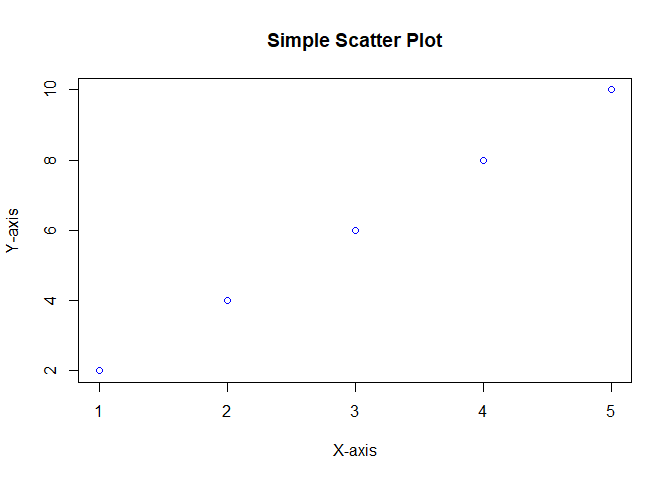
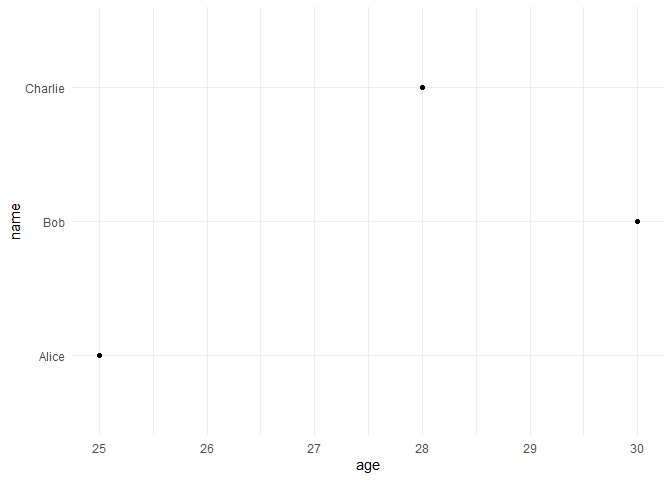

# R You Ready? Introduction to R Programming

Welcome to **R You Ready?**, a beginner-friendly guide to the **R
programming language**! R is a powerful, open-source language widely
used for statistical computing, data analysis, and visualization.
Whether you’re a data enthusiast, a scientist, or just curious, this
guide will walk you through the basics of R to get you started.

## Table of Contents

1.  [What is R?](#what-is-r)
2.  [Why Learn R?](#why-learn-r)
3.  [Setting Up R](#setting-up-r)
4.  [R Basics](#r-basics)
    - [Variables and Data Types](#variables-and-data-types)
    - [Basic Operations](#basic-operations)
    - [Vectors](#vectors)
    - [Data Frames](#data-frames)
    - [Basic Plotting](#basic-plotting)
5.  [Resources for Further Learning](#resources-for-further-learning)
6.  [Contributing](#contributing)
7.  [License](#license)

## What is R?

R is a programming language and environment designed for **statistical
analysis**, **data visualization**, and **data science**. Developed in
the 1990s by Ross Ihaka and Robert Gentleman, R is widely used in
academia, finance, pharmaceuticals, and data-driven industries for its
robust statistical tools and graphing capabilities.

## Why Learn R?

- **Data Analysis**: R excels at handling and analyzing large datasets.
- **Visualization**: Create stunning, customizable plots with packages
  like `ggplot2`.
- **Community and Packages**: Access thousands of packages via CRAN
  (Comprehensive R Archive Network).
- **Free and Open-Source**: No cost, and you can contribute to its
  development!
- **Cross-Industry Use**: Used in data science, bioinformatics,
  economics, and more.

## Setting Up R

To start coding in R, you’ll need to install R and a development
environment:

1.  **Install R**:

    - Download R from [CRAN](https://cran.r-project.org/).
    - Choose the version for your operating system (Windows, macOS, or
      Linux).
    - Follow the installation instructions.

2.  **Install RStudio** (optional but recommended):

    - RStudio is a user-friendly IDE for R.
    - Download it from [RStudio’s
      website](https://www.rstudio.com/products/rstudio/download/).

3.  **Verify Installation**:

    - Open R or RStudio and type `R.version` to check your R version.

    ``` r
     R.version
    ```

        ##                _                                
        ## platform       x86_64-w64-mingw32               
        ## arch           x86_64                           
        ## os             mingw32                          
        ## crt            ucrt                             
        ## system         x86_64, mingw32                  
        ## status                                          
        ## major          4                                
        ## minor          5.1                              
        ## year           2025                             
        ## month          06                               
        ## day            13                               
        ## svn rev        88306                            
        ## language       R                                
        ## version.string R version 4.5.1 (2025-06-13 ucrt)
        ## nickname       Great Square Root

## R Basics

Let’s dive into some basic R concepts to get you coding!Variables and
Data TypesIn R, you assign values to variables using `<-` or `=`:

``` r
# Assigning values to variables 
name <- "Alice" 
age <- 25 
is_student <- TRUE  

# Print variables 
print(name) 
```

    ## [1] "Alice"

``` r
print(age) 
```

    ## [1] 25

``` r
print(is_student)
```

    ## [1] TRUE

#### Common Data Types:

- Numeric: `3.14, 42`

- Character: `"Hello", "R is fun"`

- Logical: `TRUE, FALSE`

- Factor: Categorical data (e.g., `"low", "medium", "high"`)

## Basic Operations

R supports arithmetic and logical operations:

``` r
# Arithmetic 
x <- 10 
y <- 5 
sum <- x + y 
product <- x * y 
print(sum)    # Output: 15 
```

    ## [1] 15

``` r
print(product) # Output: 50  
```

    ## [1] 50

``` r
# Logical operations 
is_greater <- x > y 
print(is_greater) # Output: TRUE
```

    ## [1] TRUE

\##Vectors

Vectors are the building blocks of R. They store multiple values of the
same type:

``` r
# Create a numeric vector 
numbers <- c(1, 2, 3, 4, 5)  

# Create a character vector 
fruits <- c("apple", "banana", "orange")  

# Access elements 
print(numbers[1]) # Output: 1 
```

    ## [1] 1

``` r
print(fruits[2])  # Output: "banana"  
```

    ## [1] "banana"

``` r
# Vector operations 
doubled <- numbers * 2 
print(doubled) # Output: 2, 4, 6, 8, 10
```

    ## [1]  2  4  6  8 10

## Data Frames

Data frames are like tables, used to store datasets:

``` r
# Create a data frame 
data <- data.frame(name = c("Alice", "Bob", "Charlie"),   
                   age = c(25, 30, 28),   
                   city = c("New York", "London", "Tokyo"))  
# View the data frame 
print(data)  
```

    ##      name age     city
    ## 1   Alice  25 New York
    ## 2     Bob  30   London
    ## 3 Charlie  28    Tokyo

``` r
# Access a column 
print(data$age) # Output: 25, 30, 28
```

    ## [1] 25 30 28

## Basic Plotting

R makes data visualization easy with built-in plotting functions:

``` r
# Simple scatter plot 
x <- c(1, 2, 3, 4, 5) 
y <- c(2, 4, 6, 8, 10) 
plot(x, y, 
     main = "Simple Scatter Plot", 
     xlab = "X-axis", 
     ylab = "Y-axis", 
     col = "blue")
```

<!-- -->

For advanced visualizations, explore the `ggplot2` package:

``` r
#load ggplot2 
library(ggplot2)  

# Basic ggplot 
ggplot(data, aes(x = age, y = name)) + geom_point() + theme_minimal()
```

<!-- -->

## Resources for Further Learning

- **Official R Documentation:** [CRAN](https://cran.r-project.org/)

- **RStudio Tutorials:** [RStudio
  Education](https://education.rstudio.com/)

- **Online Courses:**

  - [DataCamp: Introduction to
    R](https://www.datacamp.com/courses/free-introduction-to-r)

  - [Coursera: R
    Programming](https://www.coursera.org/learn/r-programming)

- Books:

  - *R for Data Science* by Hadley Wickham and Garrett Grolemund

  - *The Art of R Programming* by Norman Matloff

- Communities:

  - [R-bloggers](https://www.r-bloggers.com/)

  - [Stack Overflow R Tag](https://stackoverflow.com/questions/tagged/r)

## Contributing

Want to improve this guide? Contributions are welcome! Please:

1.  Fork this repository.

2.  Create a new branch (`git checkout -b feature/your-feature`).

3.  Make your changes and commit (`git commit -m "Add your feature"`).

4.  Push to the branch (`git push origin feature/your-feature`).

5.  Open a Pull Request.

## License

This project is licensed under the MIT License. See the LICENSE file for
details.
